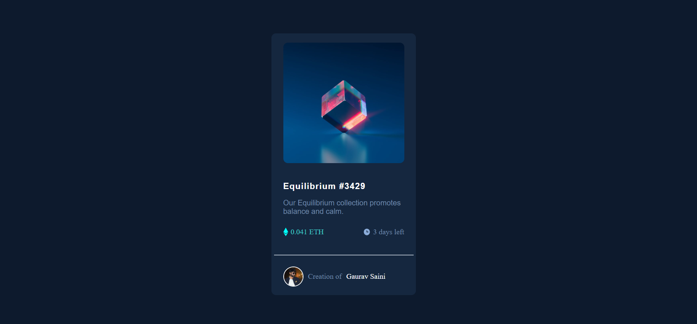

# NFT Preview Card Component

A clean and responsive NFT preview card built with HTML and CSS.  
This project focuses on layout structure, hover states, and mobile responsiveness.

## Features
- Responsive design (mobile & desktop)
- Image hover overlay with view icon
- Interactive title and author hover states
- Clean and minimal UI

## Built With
- HTML5
- CSS3 (Flexbox)
- Mobile-first approach

## Live Demo
https://golu-dhama.github.io/nft-preview-card-/

## Author
Created by Azad Dhama

## Preview

